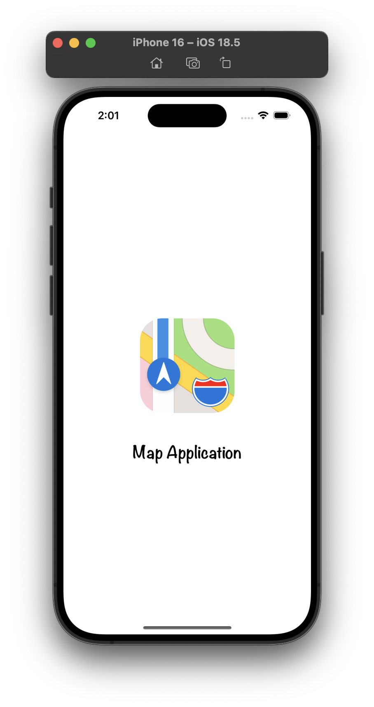
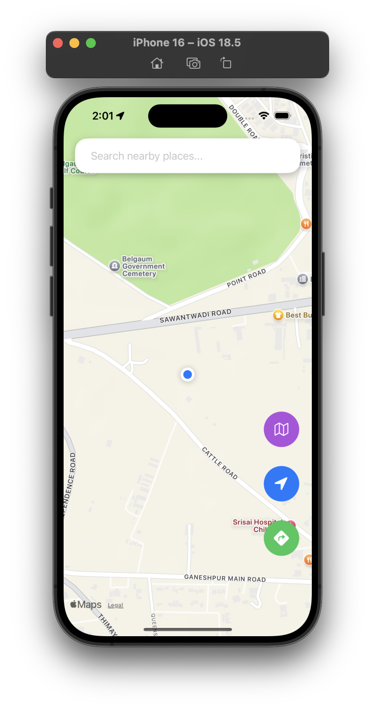
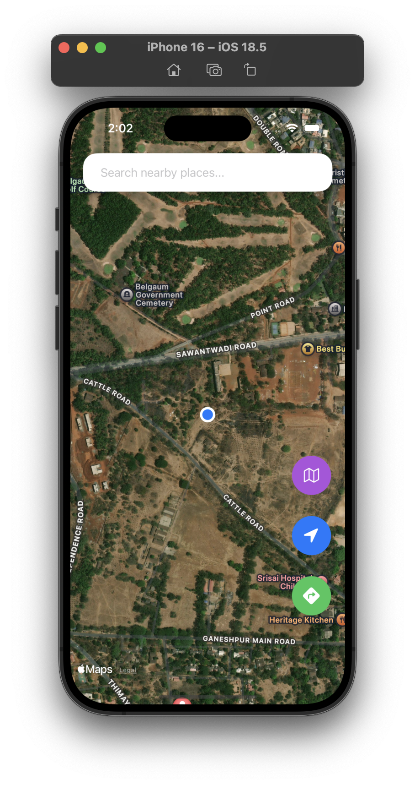
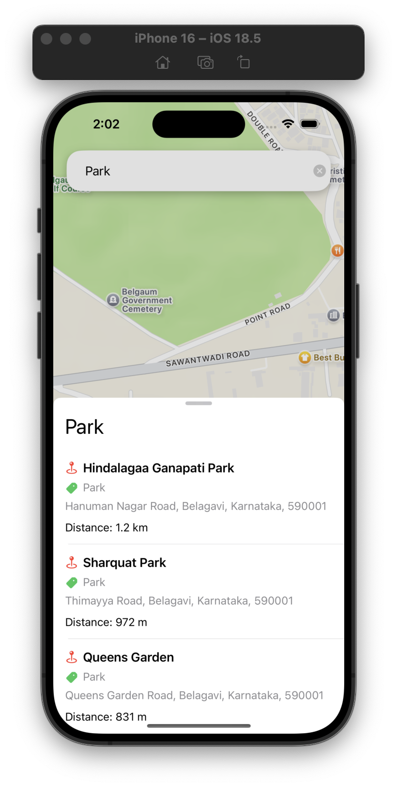
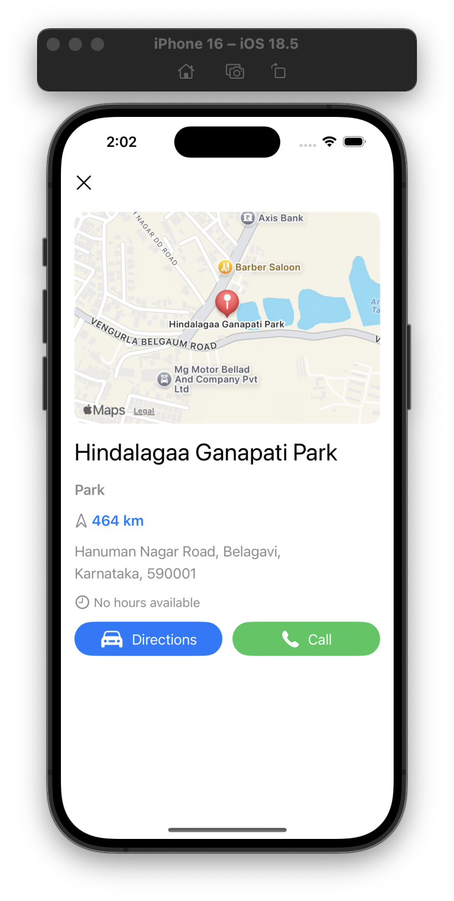
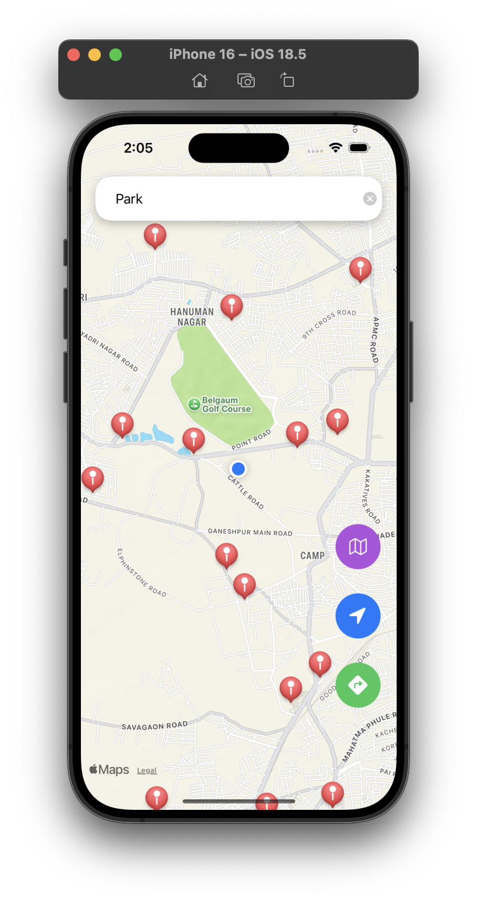
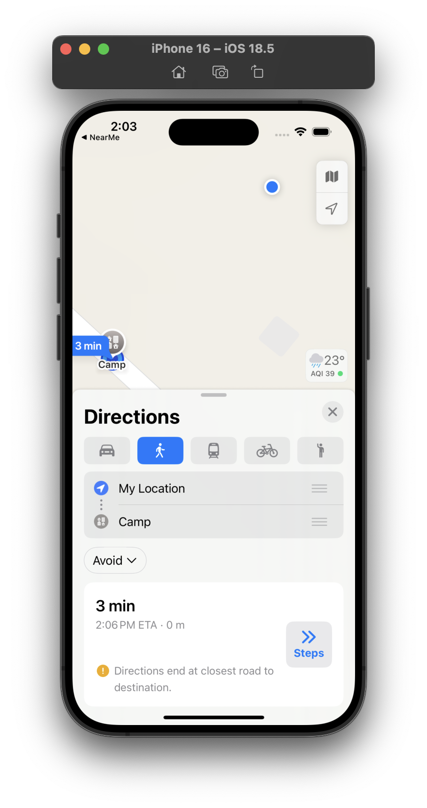

# NearMe 🗺️📍
A beginner-friendly UIKit-based iOS app that helps users explore nearby places, get directions, and interact with maps.  
This project integrates **Core Location** with **MapKit** to show the user’s current location, nearby search results, and allows switching map modes.  

---

## 🚀 Features
🔍 Search nearby places with keywords  
📍 Show user’s current location on the map  
🗺️ Map interaction with annotations  
🎯 Recenter button to return to current location  
🛣️ Directions button to open Apple Maps navigation  
🛰️ Switch between Standard, Hybrid, and Satellite map modes  
⌨️ Search text field with clear button  
✨ Shadows and clean UI styling  
📄 Bottom sheet with nearby places list 

---

## 🧰 Tech Stack
🧑‍💻 Language: Swift  
🖼️ UI Framework: UIKit  
📍 Location: Core Location  
🗺️ Maps: MapKit
💻 IDE: Xcode  
🚀 Deployment Target: iOS 15+  

---

## 📸 Screenshots

<div style="display: flex; flex-wrap: wrap; gap: 10px;">
  
  
</div>

<div style="display: flex; flex-wrap: wrap; gap: 10px;">
  
  
</div>

<div style="display: flex; flex-wrap: wrap; gap: 10px;">
  
  
</div>

<div style="display: flex; flex-wrap: wrap; gap: 10px;">
  
</div>

---

## 📁 Project Structure
```
├── NearMe.xcodeproj
└── NearMe
│   ├── Annotations
│   │   └── PlaceAnnotation.swift
│   ├── App
│   │   ├── AppDelegate.swift
│   │   └── SceneDelegate.swift
│   ├── Extensions
│   │   └── String.swift
│   ├── Info.plist
│   ├── Resources
│   │   ├── Assets.xcassets
│   │   └── Base.lproj
│   │   │   └── LaunchScreen.storyboard
│   └── ViewControllers
│       ├── PlaceDetailViewController.swift
│       ├── PlaceTableViewCell.swift
│       ├── PlacesTableViewController.swift
│       └── ViewController.swift
└── README.md

````

---

## 🛠️ Getting Started

### Prerequisites
- Xcode (latest stable version)  
- iOS SDK (15+)  
- Basic understanding of Swift & UIKit  

### Installation
```bash
git clone https://github.com/SameerNadaf/NearMe.git
cd NearMe
open NearMe.xcodeproj
````

### Run the App

* Choose a simulator or connect your iPhone
* Press **Cmd + R** to build and run

---

## 📱 Usage

1. Allow location permission when prompted.
2. Use the **search field** to look for places (e.g., "Restaurants", "Hospitals").
3. Tap a place marker to see details in a bottom sheet.
4. Use the **Recenter button** to return to your current location.
5. Use the **Directions button** to navigate via Apple Maps.
6. Toggle between **Standard / Satellite / Hybrid** map views.

---

## 🎓 Learning Purpose

This project was built as a practice project to learn:

* Working with **Core Location** & **MapKit**
* Implementing **search with MKLocalSearch**
* Designing UI with **UIKit + AutoLayout** programmatically
* Organizing code with **MVC architecture**
* Handling permissions and presenting data in bottom sheets

---

## 🤝 Contributing

This is a learning project. Fork it, improve it, or use it as a base for your own map-based app!

---

## 🪪 License

MIT License

---

## 📬 Contact & Attribution

👨‍💻 Developed by **Sameer Nadaf**
GitHub: [@SameerNadaf](https://github.com/SameerNadaf)
⭐ Drop a star if you found this project helpful!

---

## 🙌 Acknowledgments

* Apple’s **MapKit & Core Location**
* iOS UIKit community for design inspirations
